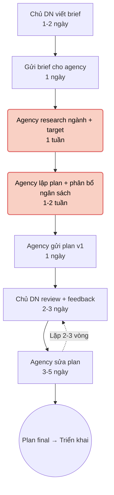
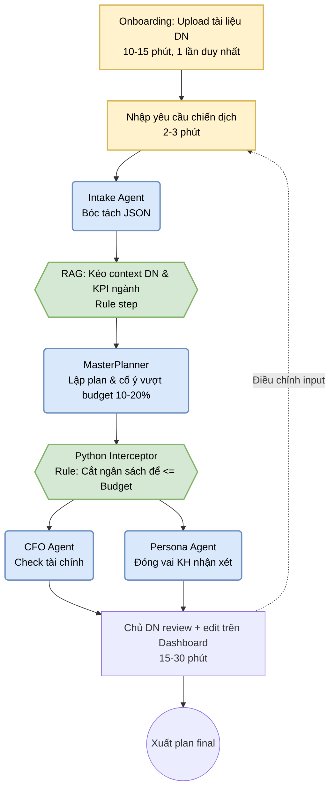

# Group Report — Day 02

## Thành viên nhóm

| STT | Họ và tên | Mã học viên | Vai trò trong nhóm |
|-----|-----------|-------------|---------------------|
| 1   | Nguyễn Văn Duy | 2A202601749 | Challenge phản biện các candidates, chấm điểm shortlist |
| 2   | Trần Bảo Ninh | 2A202601595 | Pitch candidates logistics/hợp đồng |
| 3   | Nguyễn Phúc Huy Hoàng | 2A202601951 | Validation: phỏng vấn nhanh chủ DN nhỏ |
| 4   | Vũ Việt Anh | 2A202601107 | Research giải pháp có sẵn trên thị trường |
| 5   | Phó Viết Tiến Anh | 2A202601341 | Gom cluster + hỗ trợ chấm điểm shortlist |
| 6   | Phan Trọng Tiến | 2A202601095 | Viết Problem Statement v0/v1 |
| 7   | Hoàng Duy Linh | 2A202601159 | So sánh Rule / Workflow / Agent |
| 8   | Lê Tiến Minh | 2A202601193 | Validation: khảo sát bạn bè làm MKT freelance |
| 9   | Nguyễn Tuấn Anh | 2A202601395 | Review + phản biện Problem Statement |
| 10  | Nguyễn Minh Thái | 2A202601619 | Hỗ trợ vẽ workflow before/after |
| 11  | Võ Hà Minh Huy | 2A202601373 | Pitch candidates CSKH/Sales |
| 12  | Đỗ Duy Đông | 2A202601657 | Tổng hợp decision rationale + exit criteria |
| 13  | Kiều Thế Hiệp | 2A202601435 | Pitch Card #3 MKT SME, vẽ workflow, research |

---

# Phase 3 — Group Convergence

## Pitch summary

> Mỗi người trình bày top 3 (1-2 phút/candidate). Ghi lại tóm tắt ở đây.

| Thành viên | Candidate 1 | Candidate 2 | Candidate 3 |
|---|---|---|---|
| Kiều Thế Hiệp | LLM không hiểu context DN → output chung chung | Nhập lại thông tin DN mỗi lần dùng AI tool | Thuê agency lâu + đắt so với budget SME |
| Trần Bảo Ninh | Tra cứu hợp đồng và tài liệu mất nhiều thời gian | Chuẩn hóa yêu cầu KH từ email/PDF/Excel vào hệ thống | So sánh phiên bản hợp đồng cũ vs phụ lục mới |
| Võ Hà Minh Huy | CSKH lục file chính sách 5-10 phút/lần, Senior trả lời câu hỏi lặp 1-2h/ngày | Phân loại tin nhắn KH (khiếu nại vs hỏi mua) + chia lead thủ công 30 phút | CSKH tự gõ lại câu trả lời vì template cứng, Sales dùng ChatGPT nhưng sai Brand Voice |

## Cluster — gom các ý gần nhau

| Cluster | Candidate examples | Pattern chung |
|---|---|---|
| Lập kế hoạch MKT tốn thời gian + chi phí | Thuê agency 3-4 tuần, nhân sự MKT mất 3-5 ngày, tự research KPI 2-3 ngày | SME cần plan MKT nhanh, rẻ nhưng không có nhân lực/kiến thức chuyên môn |
| LLM hiện tại chưa đủ tốt cho MKT | LLM không hiểu context DN, LLM hallucinate ngân sách, output chung chung | AI có tiềm năng nhưng thiếu context DN và kiểm soát tính toán |
| Lặp lại / không tận dụng data cũ | Nhập lại info DN mỗi lần, lập plan mới từ số 0 mỗi quý | Thiếu "bộ nhớ" về DN → lãng phí thời gian và kinh nghiệm tích lũy |
| Giao tiếp DN-Agency không hiệu quả | Brief mơ hồ → sửa nhiều vòng, chờ agency sửa plan | Quy trình agency tạo friction, SME bị động |
| Tra cứu hợp đồng và tài liệu | Tìm hợp đồng chính, phụ lục, bảng giá, SLA và điều khoản liên quan khi khách hàng yêu cầu thay đổi dịch vụ | Nhân viên phải tìm kiếm thủ công trong nhiều file và nhiều nơi lưu trữ để xác định thông tin đang có hiệu lực |
| Chuẩn hóa yêu cầu khách hàng | Đọc yêu cầu từ email, PDF hoặc Excel rồi chuyển thành các trường dữ liệu trong hệ thống nội bộ | Dữ liệu đầu vào không đồng nhất, nhân viên phải đọc, diễn giải và nhập lại bằng tay |
| So sánh phiên bản và thay đổi | So sánh hợp đồng cũ với phụ lục mới, xác định điều khoản nào đã được sửa hoặc thay thế | Các phiên bản tài liệu dễ bị nhầm lẫn, khó xác định đâu là điều khoản mới nhất |
| Phối hợp và bàn giao giữa các bộ phận | Chuyển yêu cầu giữa Customer Service, Operations, Sales, Legal và Finance | Thông tin bị phân tán qua email, chat và file đính kèm, khiến các bộ phận phải hỏi lại hoặc kiểm tra lại từ đầu |
| Tra cứu & Truyền đạt thông tin nội bộ (CSKH) | Newbie Sales mất 5-10 phút lục file chính sách để trả lời khách. Senior tốn 1-2 tiếng/ngày giải đáp câu hỏi lặp của newbie. CSKH tư vấn sai do xem nhầm version tài liệu cũ. | Dữ liệu phân mảnh, khó tìm kiếm (Search kém); phụ thuộc quá nhiều vào Senior tạo ra bottleneck |
| Phân loại & Xử lý tin nhắn đầu vào | CSKH tốn thời gian đọc chat dài để xác định khách khiếu nại hay hỏi mua. Trưởng ca tốn 30 phút chia lead thủ công. Miss tin nhắn ngoài giờ vì không phân loại được độ ưu tiên. | Khâu đọc hiểu intent và routing đang làm hoàn toàn bằng sức người, dễ quá tải khi scale up |
| Soạn thảo & Cá nhân hóa phản hồi | CSKH phải tự gõ lại câu trả lời vì template cứng khách chê "robot". Sales dùng ChatGPT viết email cho khách VIP nhưng văn phong mỗi người một kiểu, sai Brand Voice. | Template truyền thống tạo friction, LLM tự do thì thiếu context DN → mất thời gian chỉnh sửa văn phong |
| Báo cáo & Handoff (Chuyển giao) | CSKH phải copy-paste tóm tắt issue từ Zalo sang Jira/CRM để đẩy cho team Kỹ thuật. Cuối ca phải tổng hợp tay các case chưa xử lý xong để bàn giao cho ca sau. | Thao tác nhập liệu lặp lại giữa nhiều tool (Zalo, CRM, Jira) gây lãng phí thời gian (Data entry) |

## Shortlist và chấm điểm

> Thang 1-5 cho mỗi tiêu chí.

| Candidate | Actor rõ | Workflow rõ | Pain có evidence | Impact đo được | Làm trong lab | So sánh R/W/A được | Nhóm hiểu domain | Tổng |
|---|---:|---:|---:|---:|---:|---:|---:|---:|
| Lập kế hoạch MKT cho SME (gộp agency + nhân sự + tự làm) | 5 | 5 | 5 | 5 | 5 | 5 | 5 | **35** |
| Phân loại tin nhắn + routing CSKH | 5 | 5 | 5 | 4 | 4 | 5 | 4 | **32** |
| Tra cứu hợp đồng và tài liệu | 5 | 5 | 4 | 4 | 4 | 5 | 4 | 31 |
| Tra cứu thông tin nội bộ CSKH (lục file chính sách) | 5 | 4 | 5 | 4 | 4 | 4 | 4 | 30 |
| Chuẩn hóa yêu cầu KH vào hệ thống | 4 | 4 | 4 | 3 | 4 | 4 | 3 | 26 |
| LLM không hiểu context DN | 5 | 4 | 4 | 4 | 5 | 4 | 5 | 31 |
| Nhập lại info DN mỗi lần | 4 | 4 | 3 | 3 | 5 | 3 | 5 | 27 |

## Nhóm chọn candidate

**Candidate được chọn:** Lập kế hoạch marketing cho SME Việt Nam — hiện tại tốn quá nhiều thời gian và chi phí (thuê agency 3-4 tuần + 15-50 triệu, hoặc tự làm 3-5 ngày), trong khi AI pipeline có thể tạo draft plan trong 2-3 phút.

**Vì sao chọn:**
- Workflow rõ ràng nhất: có 7-8 bước tuần tự, bottleneck nằm ở bước research + lập plan.
- Impact đo được bằng cả thời gian (tuần → phút) lẫn chi phí (triệu → nghìn đồng).
- Nhóm có BrandFlow — sản phẩm thực tế đã build, có thể demo và so sánh before/after.
- Bao trùm cả 2 candidate còn lại: giải quyết luôn vấn đề context DN (#2) và lặp lại info (#3) trong cùng pipeline.
- 64% SME Việt Nam đang cắt giảm 20-40% ngân sách marketing (2025) → nhu cầu giải pháp rẻ hơn rất lớn.

**Vì sao không chọn các candidate khác:**
- "Phân loại tin nhắn + routing CSKH": pain rõ và score cao (32 điểm), workflow tốt. Tuy nhiên nhóm hiểu domain MKT sâu hơn domain CSKH, và candidate MKT đã có sản phẩm thực tế (BrandFlow) để demo.
- "Tra cứu thông tin nội bộ CSKH": bottleneck rõ (Senior bị quá tải), nhưng giải pháp thiên về knowledge base/search engine — khó so sánh Rule/Workflow/Agent đa dạng trong phạm vi lab.
- "Soạn thảo & Cá nhân hóa phản hồi CSKH": pattern giống bài MKT (LLM thiếu context DN → sai Brand Voice), nhưng scope hẹp hơn và impact nhỏ hơn.
- "Báo cáo & Handoff": chủ yếu là data entry giữa nhiều tool — giải pháp nghiêng về Rule/automation hơn AI, ít cần so sánh R/W/A.
- "Tra cứu hợp đồng và tài liệu": workflow rõ, pain thật, nhưng nhóm hiểu domain MKT SME sâu hơn domain quản lý hợp đồng. Scope hợp đồng cũng cần data nhạy cảm (legal docs), khó demo trong lab.
- "Chuẩn hóa yêu cầu KH": pain rõ ở enterprise nhưng impact khó đo trong phạm vi lab. Cần data thật từ hệ thống nội bộ.
- "So sánh phiên bản hợp đồng": kỹ thuật tốt (AI đọc + so sánh text) nhưng scope hẹp, khó so sánh R/W/A đầy đủ.
- "LLM không hiểu context DN": là một phần của problem lớn hơn, không đứng riêng được. Giải quyết nó = giải quyết 1 bước trong workflow lập kế hoạch MKT.
- "Nhập lại info DN mỗi lần": pain nhỏ hơn (15-20 phút vs 3-4 tuần), impact thấp hơn. Nằm trong solution RAG memory của candidate chính.

---

# Phase 4 — Quick Validation + Research

## Quick validation

> Kiểm tra pain có thật không bằng cách hỏi nhanh người trong ngành.

| Nguồn | Số người | Tín hiệu xác nhận | Tín hiệu phản bác | Nhóm sửa problem thế nào |
|---|---:|---|---|---|
| Phỏng vấn nhanh chủ DN nhỏ (quán cafe, shop online) | 3 | 3/3 xác nhận: tự viết plan MKT rất mất thời gian, không biết KPI ngành nào chuẩn. 2/3 đã từng thuê agency nhưng chi phí chiếm 30-50% budget MKT. | 1 người nói agency vẫn cần vì "có kinh nghiệm thực chiến, AI chưa thay được". | Thu hẹp scope: BrandFlow không thay thế agency hoàn toàn, mà giúp SME có **draft plan nhanh** để tự triển khai hoặc brief agency rõ hơn. |
| Khảo sát nhanh bạn bè làm MKT freelance | 4 | 3/4 hay dùng ChatGPT nhưng phải prompt lại nhiều lần, output "nhạt". 2/4 phàn nàn AI tính ngân sách sai. | 1 người nói template Google Sheets đã đủ cho business nhỏ. | Thêm non-AI alternative: template + dashboard. BrandFlow có giá trị khi cần cá nhân hóa theo ngành + DN cụ thể. |
| Data thị trường (web search) | — | 64% SME Việt Nam cắt 20-40% budget MKT (2025). 44% SME đã đầu tư vào AI (2024, tăng gấp đôi). 92% DN nhỏ kỳ vọng tăng trưởng. | ROI marketing trung bình SME chỉ 2.1x → cần tối ưu, không chỉ cắt giảm. | Thêm metric: không chỉ giảm chi phí, mà cần đảm bảo chất lượng plan (KPI ngành chuẩn, phân bổ hợp lý). |

**Insight sau validation:**

```text
Pain thật không chỉ nằm ở "tốn tiền thuê agency". Pain sâu hơn là: SME không có kiến thức
chuyên môn MKT để tự lập plan chất lượng, và AI hiện tại (ChatGPT/Gemini) cho output
quá chung chung vì thiếu context DN + hay sai khi tính ngân sách.

BrandFlow giải quyết bằng cách: (1) Nạp context DN vào RAG, (2) Dùng KPI ngành có sẵn,
(3) Để Python tính ngân sách thay vì AI, (4) Có CFO + Persona phản biện plan.
```

## Research giải pháp

> Tìm các tool/case/pattern đã có trên thị trường.

| Nguồn / tool / case | Link | Họ giải quyết phần nào? | Điểm mạnh | Khoảng trống / rủi ro | Bài học cho nhóm |
|---|---|---|---|---|---|
| ChatGPT / Gemini (LLM trực tiếp) | https://chat.openai.com | Brainstorm ý tưởng, viết copy, gợi ý kênh marketing | Linh hoạt, đa năng, miễn phí/rẻ | Không hiểu context DN, hallucinate ngân sách, không có bộ nhớ | Cần RAG + structured output để bù đắp |
| Jasper AI | https://jasper.ai | Content marketing: blog, email, ad copy với brand voice | Giữ brand voice tốt, SEO tích hợp | Chỉ focus content, không lập chiến lược marketing tổng thể | Pattern tốt: lưu brand voice → output nhất quán |
| Semrush / Marketing 360 | https://www.semrush.com | SEO, competitive analysis, quản lý ads | Data-driven, phân tích đối thủ rõ | Phức tạp cho SME, chi phí $100+/tháng, không lập plan tổng thể | Dashboard insight tốt nhưng thiếu planning engine |
| Canva AI | https://www.canva.com | Thiết kế visual, social media content | Dễ dùng, AI-assisted design | Chỉ giải quyết phần visual, không lập chiến lược | Quan trọng: AI phải dễ dùng cho non-expert |
| Zapier + LLM combo | https://zapier.com | Tự động hóa workflow: lead capture → email → CRM | Kết nối nhiều tool, tiết kiệm thời gian | Cần setup phức tạp, không có planning logic | Pattern: workflow automation vs agent autonomy |

**Research takeaway:**

```text
Không có tool nào trên thị trường giải quyết đúng bài toán "lập kế hoạch marketing tổng thể
cho SME Việt Nam" với đầy đủ: context DN + KPI ngành Việt Nam + phân bổ ngân sách chính xác
+ phản biện từ nhiều góc.

Các tool hiện có hoặc quá chung (ChatGPT), hoặc chỉ giải quyết 1 phần (Jasper = content,
Semrush = SEO, Canva = visual). BrandFlow là sự kết hợp:
- RAG memory (như Jasper lưu brand voice)
- Planning engine (như Semrush cho data ngành)
- Budget logic (Python, không AI — tránh hallucination)
- Multi-perspective review (CFO + Persona — chưa tool nào có)
```

---

# Phase 5 — Workflow + Problem Statement

## Workflow before/after

### Current State — Thuê agency


*Tổng: 3-4 tuần, 15-50 triệu VND. Bottleneck chính: Chờ agency research và lập plan (màu cam).*

### Future State — BrandFlow AI Pipeline


*Tổng: dưới 1 giờ, chi phí < 5.000đ. Màu vàng: Human boundary. Màu xanh dương: AI. Màu xanh lá: Rule. Nút thắt mới ở bước Review (màu cam) nhưng là boundary cần thiết.*

Fallback: Plan AI không đạt chất lượng → chủ DN điều chỉnh input và chạy lại. Nếu vẫn không ổn → dùng output AI như brief chi tiết để gửi agency.

### Before/after impact

| Metric | Trước (Agency) | Sau kỳ vọng (BrandFlow) | Ghi chú |
|---|---:|---:|---|
| Tổng thời gian | 3-4 tuần | Dưới 1 giờ (lần đầu), 20 phút (các lần sau) | Target chính |
| Số bước | 8 bước | 9 bước (nhưng 6 bước tự động) | Không chỉ giảm bước, mà giảm effort/bước |
| Bước thủ công | 8/8 | 3/9 (onboarding, nhập yêu cầu, review) | Chủ DN chỉ làm input + review |
| Chi phí | 15-50 triệu | < 5.000đ (API cost) | Giảm 3.000-10.000 lần |
| Bottleneck chính | Chờ agency research + lập plan | Chủ DN review + edit | Human boundary |
| Risk mới | Không có AI risk | Hallucination, plan thiếu thực chiến | Cần Python Interceptor + human review |
| Khả năng điều chỉnh | 2-3 ngày/lần sửa | Real-time (chạy lại pipeline 2-3 phút) | SME chủ động hoàn toàn |

## Problem Statement v0

| Field | Nội dung |
|---|---|
| **Actor** | Chủ doanh nghiệp SME Việt Nam có ngân sách marketing giới hạn (20-100 triệu/quý), không có nhân sự marketing chuyên trách. |
| **Workflow** | Khi cần chạy chiến dịch mới, chủ DN viết brief → gửi agency → chờ research + lập plan → review + feedback → agency sửa → plan final. Tổng: 3-4 tuần, chi phí 15-50 triệu. |
| **Bottleneck** | Bước agency research + lập plan mất 2-3 tuần, chủ DN bị động hoàn toàn. Nếu tự làm bằng LLM thì output chung chung vì thiếu context DN và AI hay sai khi tính ngân sách. |
| **Impact** | 3-4 tuần delay có thể lỡ thời điểm kinh doanh (khai trương, mùa sale). Chi phí agency chiếm 15-50% tổng budget MKT. 64% SME Việt Nam đang cắt giảm 20-40% ngân sách MKT. |
| **Success Metric** | Giảm thời gian có draft plan từ 3-4 tuần xuống dưới 1 giờ. Chi phí từ 15-50 triệu xuống dưới 100.000đ. Không giảm chất lượng: KPI ngành phải chuẩn, ngân sách phải cân. |
| **Boundary** | AI không tự triển khai chiến dịch. AI không tự quyết định ngân sách cuối. Chủ DN phải review và approve plan trước khi thực hiện. |

---

# Phase 6 — Rule / Workflow / Agent + Decision

## So sánh Rule / Workflow / Agent

| Mức | Phương án | Khi nào đủ | Rủi ro | Chọn? |
|---|---|---|---|---|
| **Rule** | Template plan cố định theo ngành + auto-fill budget bằng Excel/Google Sheets | Đủ nếu SME chỉ cần framework chung, không cần cá nhân hóa | Không cá nhân hóa theo DN cụ thể, KPI cứng nhắc, chủ DN vẫn phải tự viết narrative | Không chọn làm toàn bộ, nhưng **dùng cho bước cắt ngân sách** (Python Interceptor) |
| **Workflow** | Pipeline tuyến tính: Intake → RAG context → MasterPlanner → Python cắt budget → CFO + Persona review → Human review | Hợp lý nhất vì workflow tuyến tính, mỗi bước có input/output rõ, AI chỉ hỗ trợ ở bước cần ngôn ngữ/sáng tạo | Draft plan có thể "nhạt" hoặc thiếu thực chiến, cần human review | **Chọn** |
| **Agent** | Agent tự lấy data từ nhiều nguồn (Google Trends, Facebook Ads, đối thủ), tự lập plan, tự điều chỉnh, tự gửi cho stakeholder | Chỉ cần nếu workflow nhiều nhánh, cần quyết định động, nhiều tool integration | Quá rộng, nhiều permission/risk, khó kiểm soát output, tốn API cost, SME khó tin tưởng | Chưa chọn — scope quá lớn cho MVP |

**Mức chọn:**

```text
Workflow — kết hợp Rule ở bước tính ngân sách.
```

**Vì sao chọn Workflow:**
- Pipeline tuyến tính rõ ràng: Input → 4 bước AI/Rule → Human review → Output.
- Mỗi bước có vai trò cụ thể, không cần AI tự quyết định bước tiếp theo.
- Python Interceptor (Rule) giải quyết chính xác bài toán ngân sách — không hallucination.
- Human review là boundary rõ ràng — chủ DN vẫn quyết định cuối cùng.
- Đã có implementation thực tế (BrandFlow) chạy được, có thể demo.

**Vì sao không chọn Agent:**
- SME owner không cần AI tự quyết định chiến lược — họ cần draft nhanh để review.
- Agent tự lấy data từ nhiều nguồn (Google Trends, FB Ads) → cần nhiều API key, permission phức tạp.
- Risk cao hơn: agent tự sửa plan có thể đi sai hướng mà chủ DN không kiểm soát được.
- Chi phí API cao hơn nhiều so với workflow 1 lượt.

## Problem Statement v1 (sau khi chọn mức AI)

| Field | Nội dung |
|---|---|
| **Actor** | Chủ doanh nghiệp SME Việt Nam (ngân sách MKT 20-100 triệu/quý), không có nhân sự marketing chuyên trách. |
| **Workflow** | Viết brief → gửi agency → chờ research + plan → review + sửa → plan final. Hoặc tự hỏi LLM nhưng output chung chung. |
| **Bottleneck** | Agency mất 2-3 tuần research + lập plan, chủ DN bị động. LLM thiếu context DN + hallucinate ngân sách. |
| **Impact** | 3-4 tuần + 15-50 triệu/plan. Có thể lỡ thời điểm kinh doanh. 64% SME đang cắt budget MKT. |
| **Success Metric** | Thời gian: 3-4 tuần → dưới 1 giờ. Chi phí: 15-50 triệu → dưới 100.000đ. Chất lượng: KPI ngành chuẩn, ngân sách cân (tổng ≤ budget). |
| **Boundary** | AI không tự triển khai chiến dịch. AI không tự quyết ngân sách cuối. AI không tự gửi plan cho stakeholder. Chủ DN review + approve trước khi thực hiện. |
| **AI intervention point** | Sau khi chủ DN nhập yêu cầu, trước bước review: AI lập plan (MasterPlanner), Python cắt ngân sách (Interceptor), AI phản biện (CFO + Persona). |
| **Mức chọn** | Workflow: Intake → RAG context → MasterPlanner (AI) → Python Interceptor (Rule) → CFO + Persona (AI, song song) → Human review. |
| **Rủi ro & người thật kiểm tra** | Risk: hallucination ở narrative, plan thiếu thực chiến, KPI không sát thực tế VN. Kiểm tra: chủ DN review plan, so sánh KPI với benchmark ngành, kiểm tra tổng ngân sách ≤ budget. |

## Decision

```text
Go với scope nhỏ.
```

**Pilot nhỏ nhất:**
- Dùng BrandFlow với 3 case thật: quán cafe khai trương (F&B), shop online ra sản phẩm mới (E-commerce), spa chạy khuyến mãi (Beauty).
- Mỗi case: chủ DN nhập yêu cầu → pipeline chạy → chủ DN đánh giá plan (1-5 sao) + ghi feedback.
- Đo: thời gian tạo plan, số lần chạy lại, điểm đánh giá chất lượng, ngân sách có cân không.

**Exit / rollback:**
- Nếu ≥ 2/3 case được đánh giá dưới 3 sao trong 2 tuần pilot → hạ xuống template + dashboard (Rule).
- Nếu Python Interceptor vẫn để lọt ngân sách vượt budget → fix logic Python, không thêm AI.
- Nếu chủ DN không tin plan AI → dùng output như "brief nâng cao" để gửi agency (vẫn tiết kiệm 1-2 tuần brief).

**Decision rationale:**
- Problem rõ, workflow rõ, metric rõ — đủ điều kiện Go.
- Có sản phẩm thực tế (BrandFlow) đã build và chạy được.
- Workflow không cần agent: pipeline tuyến tính, mỗi bước xác định.
- Human review rõ ràng: chủ DN kiểm soát output cuối.
- Chi phí pilot gần 0 (chỉ tốn API cost).
- Có non-AI fallback: template + dashboard nếu AI không đạt chất lượng.
- Có exit plan rõ: nếu pilot thất bại → hạ về Rule hoặc dùng như brief tool.
